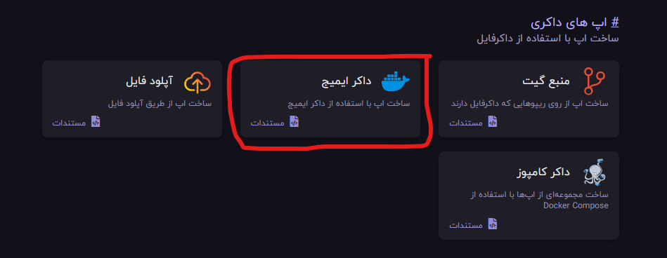
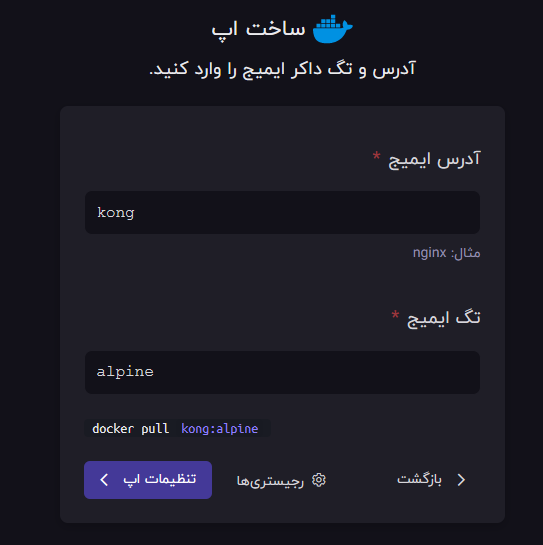
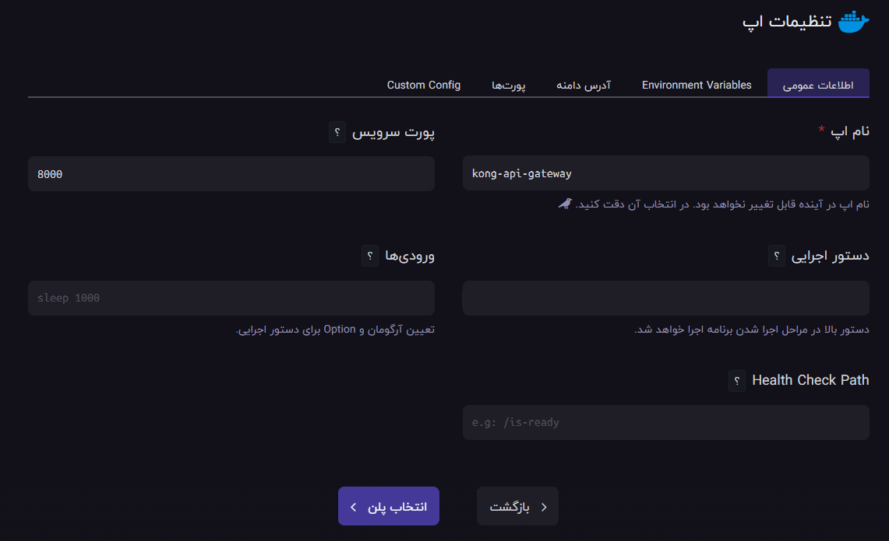
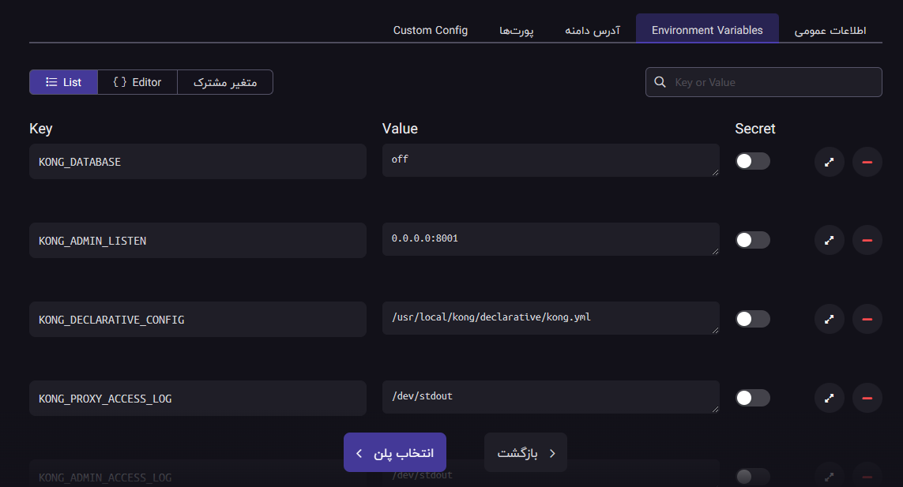
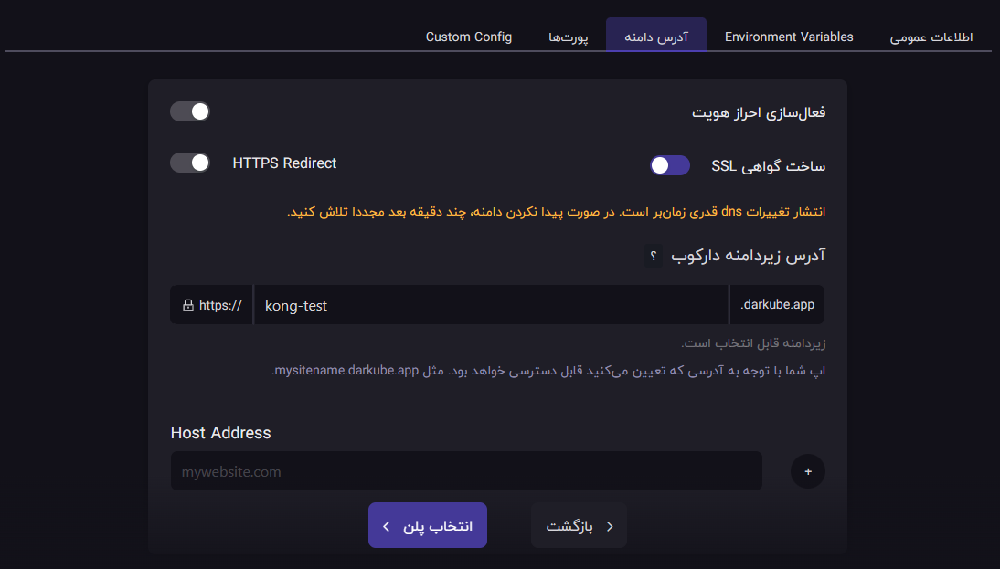
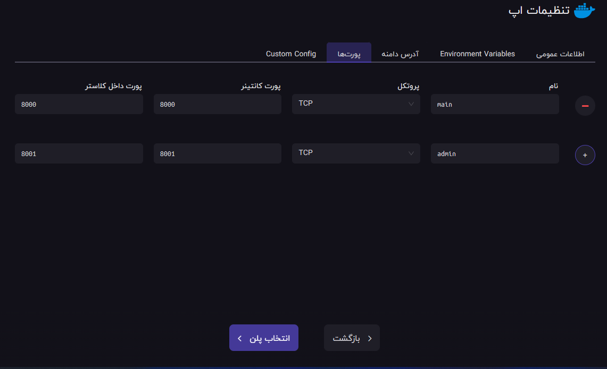
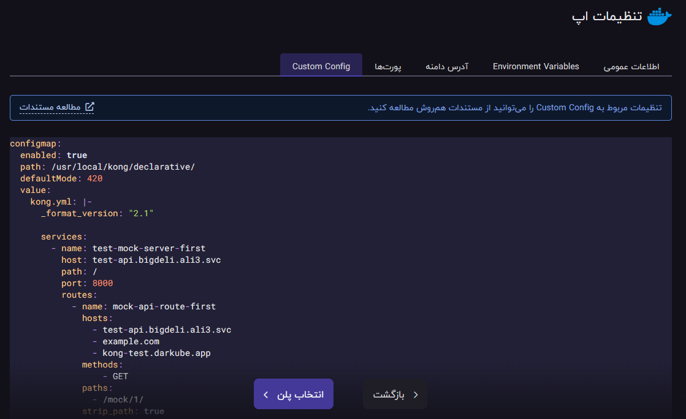
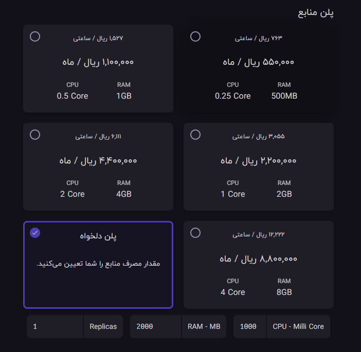
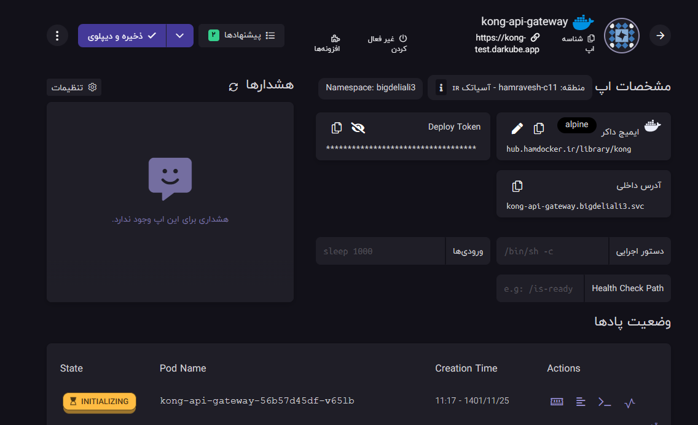

<div align="center">
<div align="center" ></div>

<h1 align="center">Kong Declarative (DB-Less) Approach</h1>
<h3 align="center">A brief sample of creating a service and route for two api as sample </h3>
</div>

# Guideline
- [Guideline](#guideline)
- [Development Usage](#development-usage)
  - [explanation](#explanation)
    - [kong.yml](#kongyml)
    - [mock\_api.py](#mock_apipy)
  - [Testing UseCase](#testing-usecase)
    - [Access First app](#access-first-app)
    - [Access First app](#access-first-app-1)
- [Hamravesh Deployment](#hamravesh-deployment)
  - [Separate Repo](#separate-repo)
  - [Docker Implementation](#docker-implementation)
  - [1- create a docker app](#1--create-a-docker-app)
  - [2- define general configurations](#2--define-general-configurations)
    - [general info](#general-info)
    - [environments](#environments)
    - [domain](#domain)
    - [ports](#ports)
    - [custom config](#custom-config)
  - [3- choose the resource](#3--choose-the-resource)
  - [4-wait for deployment](#4-wait-for-deployment)


# Development Usage
for testing purposes i have already provided a sample for you in ```KongDeclarative``` directory. which you can see it in action by going inside the directory and running the bellow command to run it:
```bash
docker-compose up --build
```

## explanation
Of course the starting point fo the project is the docker-compose file but, beside that you will find ```kong.yml``` and ```mock_api.py``` that are obviously config file and the api that we are going to test through kong api gateway.

### kong.yml
in this file i just provided two services and routes which will lead to the api which will be running inside the docker-compose file.
the content of the file is just as follows and you can find more configurations in the provided link below:
```yaml
_format_version: "2.1"


# declaring services
services:

  # declare a service name
  - name: test-mock-server-first

    # declare a host name
    host: mock_api_1

    # what path does this host belongs
    path: /

    # port of the host service provider
    port: 8000

    # list of the routes 
    routes:

      # creating one route for mock_api
      - name: mock-api-route-first

        # declaring entrance hosts
        hosts: 
          - mock_api_1
          - localhost

        # declaring allowed methods
        methods:
            - GET

        # which path leads to this service
        paths:
          - /mock/1/

        # strip the entered path
        strip_path: true
  
  # declare a service name
  - name: test-mock-server-second

    # declare a host name
    host: mock_api_2

    # what path does this host belongs
    path: /

    # port of the host service provider
    port: 8000

    # list of the routes 
    routes:

      # creating one route for mock_api
      - name: mock-api-route-second

        # declaring entrance hosts
        hosts: 
          - mock_api_2
          - localhost

        # declaring allowed methods
        methods:
            - GET

        # which path leads to this service
        paths:
          - /mock/2/

        # strip the entered path
        strip_path: true
```
If you need more information take a look at these links:
 - <https://docs.konghq.com/gateway/latest/production/deployment-topologies/db-less-and-declarative-config/>
 - <https://www.youtube.com/watch?v=xSyerlcBJJM>

### mock_api.py
this file has the most simplest api based on fast api which will be running over uvicorn in docker-compose command. in order to show the difference of the api execution i have included an environment variable for ease of change and test which can be changed inside the docker-compose config.
```python
from fastapi import FastAPI
import os

app = FastAPI()

@app.get("/api/test")
async def root():
    version_name = os.environ.get('name')
    return {
        "message": "testing ap in kong ",
        "version": f"{version_name}"
    }
```

## Testing UseCase
after running the docker-compose file through the command i noticed at the beginning you can access the api through the provided links:

### Access First app
if you want to access the first app api use the link below:

<http://localhost/mock/1/api/test>

what you will get in response will be the same as below:
```json
{
    "message": "testing ap in kong ",
    "version": "first"
}
```

### Access First app
if you want to access the second app api use the link below:

<http://localhost/mock/2/api/test>

what you will get in response will be the same as below:
```json
{
    "message": "testing ap in kong ",
    "version": "second"
}
```

# Hamravesh Deployment
Based on my knowledge of hamravesh you have two options:
- Create a separate repo with dockerfile
- Use Docker implementation

## Separate Repo
in this scenario you would have to create a repository and based on that a docker file to be able to create and hold kong.yml configurations inside that repo so that every time you make changes all you need to do is to commit 
changes and update the config on the fly.

## Docker Implementation
well all you have to do is to follow the steps below:

## 1- create a docker app
first of all start by select on creating a docker app
<div align="center" ></div>

after that you have to define the image and tag for the deployment:

<div align="center" ></div>


Note:based on your need an comparability choose your tag.

## 2- define general configurations

### general info

in this part need to provide the default name for the app and also the main port for the program which is going to be 8000 cause by default kong is listening for incoming requests of the user on this port.

<div align="center" ></div>


### environments

in environment section just copy and paste the minimum configs that we provided:
<div align="center" ></div>

```properties
KONG_DATABASE=off
KONG_ADMIN_LISTEN=0.0.0.0:8001
KONG_DECLARATIVE_CONFIG=/usr/local/kong/declarative/kong.yml
KONG_PROXY_ACCESS_LOG=/dev/stdout
KONG_ADMIN_ACCESS_LOG=/dev/stdout
KONG_PROXY_ERROR_LOG=/dev/stderr
KONG_ADMIN_ERROR_LOG=/dev/stderr
```

### domain

after that you have to config the domain part of the app.keep it in mind that you can give your own domain name too but you have to config the name and config it through a domain provider.

<div align="center" ></div>

Note: for our testing purpose we will use the subdomain instead.


### ports

now its time for ports. we already have defined port 8000 as main but if you ever needed to access another port like 8001 for admin control you can add it like below and give an external access to your app to control it. how ever in declarative mode your not gonna need it.

<div align="center" ></div>


### custom config 

this part is important cause we are going to add the configuration that we need to the kong.
<div align="center" ></div>


```yaml
configmap:
  enabled: true
  path: /usr/local/kong/declarative/
  defaultMode: 420
  value:
    kong.yml: |-
      _format_version: "2.1"

      services:
        - name: test-mock-server-first
          host: test-api.bigdeli.ali3.svc
          path: /
          port: 8000
          routes:
            - name: mock-api-route-first
              hosts: 
                - test-api.bigdeli.ali3.svc
                - example.com
                - kong-test.darkube.app
              methods:
                  - GET
              paths:
                - /mock/1/
              strip_path: true

```


## 3- choose the resource
this section is based on the traffic which will be routed to your api. but we will use the minimum usage for this test.after setup just deploy the app.
for more information please check the reference below:

<https://docs.konghq.com/gateway/latest/production/sizing-guidelines/>


<div align="center" ></div>

## 4-wait for deployment
remember we did just the kong part now you should have the api to connect it to the kong gateway also, so get busy and work on it yourself.
<div align="center" ></div>

