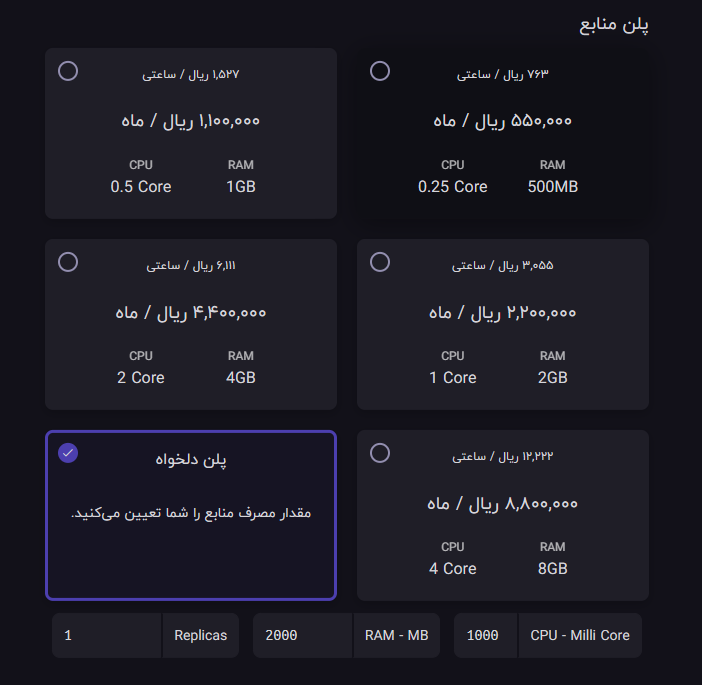

<div align="center">
<h1 align="center">Kong With Primate Approach</h1>
<h3 align="center">A brief sample of creating a service and route for two api as sample </h3>
</div>

# Guideline
- [Guideline](#guideline)
- [Development Usage](#development-usage)
  - [explanation](#explanation)
    - [mock\_api.py](#mock_apipy)
  - [Testing UseCase](#testing-usecase)
  - [setup primate](#setup-primate)
    - [Open the app](#open-the-app)
    - [Setup Connection](#setup-connection)
    - [Setup Services](#setup-services)
    - [Setup Route](#setup-route)
  - [Testing the API](#testing-the-api)
- [Hamravesh Deployment](#hamravesh-deployment)
  - [0- create a database](#0--create-a-database)
  - [1- create a docker app](#1--create-a-docker-app)
  - [2- define general configurations](#2--define-general-configurations)
    - [general info](#general-info)
    - [environments](#environments)
    - [domain](#domain)
    - [ports](#ports)
    - [choose the right plan](#choose-the-right-plan)
    - [Deploying](#deploying)
  - [connect to kong](#connect-to-kong)


# Development Usage
for testing purposes i have already provided a sample for you in ```KongWithPrimate``` directory. which you can see it in action by going inside the directory and running the bellow command to run it:
```bash
docker-compose up --build
```

## explanation
Of course the starting point fo the project is the docker-compose file but, beside that you will find ```mock_api.py``` that is the api that we are going to test through kong api gateway.

### mock_api.py
this file has the most simplest api based on fast api which will be running over uvicorn in docker-compose command. in order to show the difference of the api execution i have included an environment variable for ease of change and test which can be changed inside the docker-compose config.
```python
from fastapi import FastAPI
import os

app = FastAPI()

@app.get("/api/test")
async def root():
    version_name = os.environ.get('name')
    return {
        "message": "testing ap in kong ",
        "version": f"{version_name}"
    }
```

## Testing UseCase
in order to work with kong with database integration you first need to migrate the db changes at the beginning of the start up. that why we have a dedicated container for this purpose in docker-compose file as blow:

```yaml
  kong-migrations:
    image: kong:3.1.1-alpine
    environment:
      - KONG_DATABASE=postgres
      - KONG_PG_HOST=kong-database
      - KONG_PG_PASSWORD=abcdefg123456
      - KONG_CASSANDRA_CONTACT_POINTS=kong-database
    command: kong migrations bootstrap
    restart: on-failure
    depends_on:
      - kong-database
```

when all the services are up and running we are going to need a ui controller for kong admin. which in this use case we are about to use Primate.
<div align="center" ></div>
you can access the site through the link below. just download the correct app for your os and install it.

<https://www.getprimate.xyz/>


## setup primate

### Open the app
After successful installation open the app.
<div align="center" ></div>
click on the connect button in the middle of the screen to add a connection to a kong instance.

### Setup Connection
in this section just add your host address and port for connecting to the kong admin configuration backend.

<div align="center" ></div>

after providing the configurations in order to see if it works you can use the test button and if it was successful you can proceed and create it.

and right after that you can see the dashboard for you kong gateway.
<div align="center" ></div>

### Setup Services
just click on the services tab in sidebar and add a service. 

in this section we will declare our service which is going to be the moc_api that we have it running in the container inside docker-compose file.

<div align="center" ></div>
<div align="center" ></div>

you can give the configs like below:
```properties
protocol: http
host: mock_api
port: 8000
service name: mock-api #anything you want
request path: /
```
and leave the others as default.

after that just create the service.

### Setup Route
just head to the ```Routes``` section. and click on ```New Route```, or simply click on the plus button in sidebar.

for simplicity we will just create a route to get method for mock_api service.

<div align="center" ></div>
<div align="center" ></div>
<div align="center" ></div>

configurations will be as bellow:
```properties
route name: mock-api
service: mock-api # choose the one you created
protocols: http,https # choose more if needed
methods: GET # choose more if needed
hosts: mock_api,localhost # add based on the service name
paths: /mock # just for separating every service
```
after its done just hit create

Note: this is only for testing and you can customize it based on your needs.


## Testing the API
when you are done with all the configurations you should be able to access the mock api by the address below:

<http://localhost/mock/api/test>

and get the below response:
```json
{
  "message": "testing ap in kong ",
  "version": "test"
}
```

# Hamravesh Deployment

## 0- create a database
in order for kong to save every configurations you provide it is going to need a database which in my case we are using postgresql. so you need to create a postgre instance.

please follow the instructions provided in the database creation section in here:

<https://github.com/AliBigdeli/Django-Hamravesh-Docker-Template#2--setup-database>

after successfully creating the database head to the terminal and create a database name kong so that kong can interact with it. this name is by default set inside kong settings.
```bash
psql -U postgres -c "create database kong"
```


## 1- create a docker app
first of all start by select on creating a docker app
<div align="center" ></div>

after that you have to define the image and tag for the deployment:

<div align="center" ></div>


Note:based on your need an comparability choose your tag.

## 2- define general configurations

### general info

in this part need to provide the default name for the app and also the main port for the program which is going to be 8000 cause by default kong is listening for incoming requests of the user on this port.

<strong>Note: if you want to use the database you need to do the kong migrations first so in this section add ```kong migrations bootstrap``` to the command section. Remember to remove this command after successful deployment of the app and again deploy it.</strong>

<div align="center" ></div>


### environments

in environment section just copy and paste the minimum configs that we provided:
<div align="center" ></div>

```properties
KONG_DATABASE="postgres"
KONG_ADMIN_LISTEN="0.0.0.0:8001"
KONG_PG_HOST="kong-database.bigdeliali3.svc"
KONG_PG_PASSWORD="BHgl0P8Kq0YWnZF78Qgyt9MBpqQsocQu"
KONG_CASSANDRA_CONTACT_POINTS="kong-database.bigdeliali3.svc"
KONG_PG_USER="postgres"
KONG_TRUSTED_IPS="0.0.0.0/0"
```

### domain

after that you have to config the domain part of the app.keep it in mind that you can give your own domain name too but you have to config the name and config it through a domain provider.

<div align="center" ></div>

Note: for our testing purpose we will use the subdomain instead.


### ports

now its time for ports. we already have defined port 8000 as main but if you ever needed to access another port like 8001 for admin control you can add it like below and give an external access to your app to control it.

<div align="center" ></div>


### choose the right plan
this section is based on the traffic which will be routed to your api. but we will use the minimum usage for this test.after setup just deploy the app.
for more information please check the reference below:

<https://docs.konghq.com/gateway/latest/production/sizing-guidelines/>


<div align="center" ></div>

### Deploying
after click on deploy check the logs and see if the migrations are done or not. if it is done head to the main page of the app and remove the command for migrations and hit deploy again. and your done.


## connect to kong
As you have seen we can connect to kong with primate easily from localhost but we need to access the one which is online too. in order to do that you have to give public access to the app. so head to the port settings of the app and click on switch for the public access.

now you will have an outer address with an outer port to access the app from internet.

<div align="center" ></div>

Just like what we went through in early steps of the primate setup just change the configs with the new provided information of host and port.