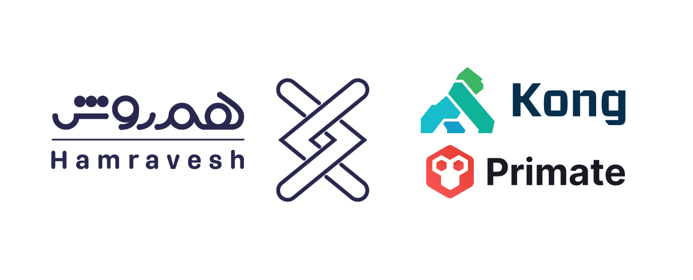

<h1 align="center">Kong ApiGateway Deployments</h1>
<h3 align="center">Sample repo to show you how you can use kong with ui or without</h3>

# Guideline
- [Guideline](#guideline)
- [What is ApiGateway](#what-is-apigateway)
- [API gateways and monolithic apps](#api-gateways-and-monolithic-apps)
- [What is Kong](#what-is-kong)
- [Kong Deployments](#kong-deployments)
- [License](#license)
- [Bugs](#bugs)

# What is ApiGateway

An application programming interface (API) gateway is software that takes an application user’s request, routes it to one or more backend services, gathers the appropriate data and delivers it to the user in a single, combined package. It also provides analytics, layers of threat protection and other security for the application.

# API gateways and monolithic apps
API gateways sit between a user and a collection of microservices, providing three key services:

- **Request routing:** An API gateway receives a new API request, turns it into multiple requests, consults a routing map that shows where each request should be sent and sends the requests to the appropriate internal microservice or microservices.
- **API composition:** The API gateway provides workflow orchestration as it aggregates the requested information from multiple microservices, bundles the data and returns it to the requestor in composite form.
- **Protocol translation:** API gateways know that API requests come in via devices that use different API protocols, and they help client requests and microservices communicate with each other by translating those protocols. The gateway translates API protocols from what the end-user device uses — whether a web browser, mobile or another endpoint — to the microservice's protocols. A wide area network (WAN) and local area network (LAN), for instance, perform differently and have different API needs. When information comes back, the gateway transforms and sends it back to requestors in the way they can view it. If, for instance, a microservice provides a response in XML, but the request came in using JSON, the gateway automatically does that translation. A REST API uses the HTTP protocol to request API services.

# What is Kong
Kong is an open source API gateway and platform that acts as middleware between compute clients and the API-centric applications. The platform easily extends the capabilities of APIs with the use of plugins. Kong is used by developers and software product owners to create portals to APIs, manage them and adjust for scaling.

Popular features deployed through Kong include:

- Authentication on services for protection.
- Traffic control to restrict inbound and outbound API traffic.
- Analytics to inspect, monitor and visualize microservices
- Request and response transformations on the fly.
- Stream request and response data to logging solutions.
- Invoking serverless

# Kong Deployments

There are a lot of ways to deploy kong but i will be teaching you two types:

- <a href="./KongDeclarative">Declarative or DB-Less Mode</a>
- <a href="./KongWithPrimate">With Primate and Database</a>

# License
MIT.

# Bugs
Feel free to let me know if something needs to be fixed. or even any features seems to be needed in this repo.

